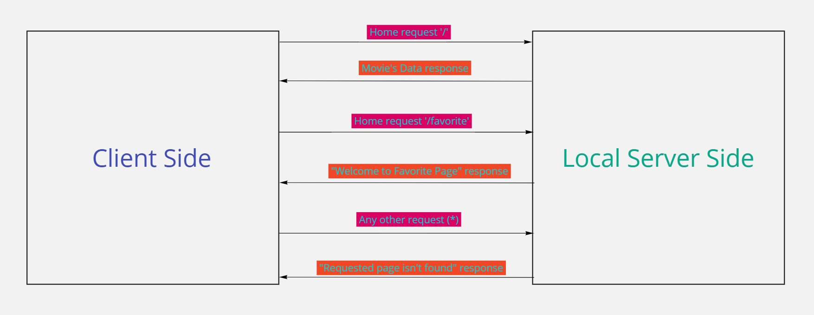

# Movies - V1.01

**Author Name**:waseem abuameer

## WRRC

## Overview 
LTUC Day 11 Task.

## Getting Started
- Clone this repo.
- Cd to repo local directory.
- npm init -y.
- npm install express cors.

## Project Features
- Includes serveral endpoints such as ('/', '/favorite' and '*' when you enter something wrong).
 

# Movies-Library - Version 2.0

## WRRC

## Project Features
- Includes serveral endpoints such as ('/','/topRated','/search','/trending','/upcoming', '/favorite' and '*' when you enter something wrong).
## Getting Started
- Create an API Key.
- Install Axios to send an HTTP request to the API.
- Created .env file and add the API Key there.
- Installed dotenv library the configure it to make our server read the .env file.
- Created .env where I show the required variable for any developer will work on the same project.
- I created an error handler.
- I created a new end point that take the parameter from the URl where we found it inside req.query.
- Run the server by node server.js.